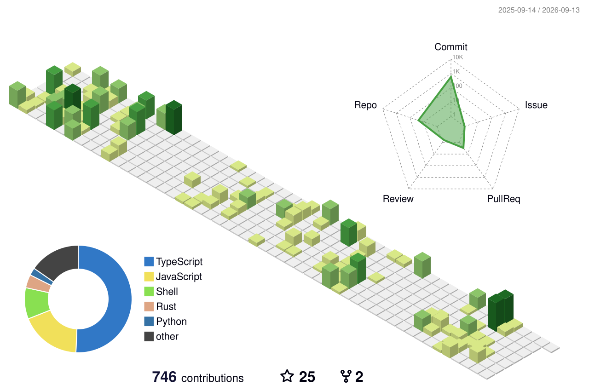

<!-- ========================================================= -->
<!--                     HERO HEADER                           -->
<!-- ========================================================= -->

  

# 🧊 𝘿𝘼𝙍𝙎𝙃𝘼𝙉

### Full Stack Developer • Graphic Designer • Programmer • Front-End Developer

Building modern applications, creating clean UI, learning Cyber Security,
and turning ideas into reality.

---

---

> **"𝙄𝙛 𝙮𝙤𝙪𝙧 𝙢𝙞𝙣𝙙 𝙛𝙪𝙘𝙠𝙨 𝙮𝙤𝙪, 𝙩𝙝𝙚𝙣 𝙧𝙚𝙫𝙚𝙧𝙨𝙚-𝙛𝙪𝙘𝙠 𝙮𝙤𝙪𝙧 𝙢𝙞𝙣𝙙"**

---

<!-- ========================================================= -->
<!--                        SKILLS                             -->
<!-- ========================================================= -->

  
  
  
  
  
  
  
  
  
  
  
  
  
   
  
  
  
  
  
  
  
  
  
  
  
  
   
  
  
  
  
  
  
  
  
  
  
  
  
   
  
  

---

<!-- 3D contribution calendar (auto-generated daily by .github/workflows/profile-3d.yml) -->

