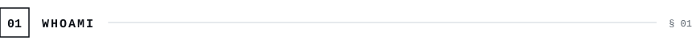
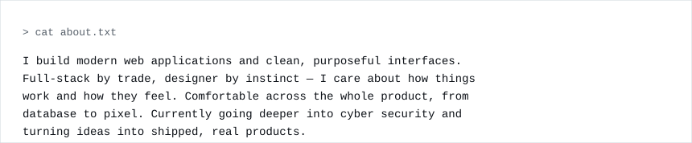
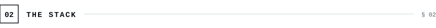
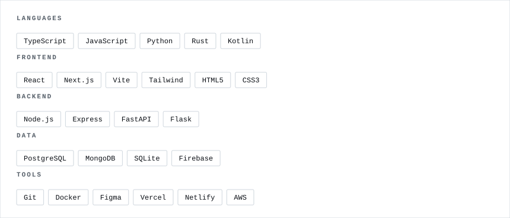
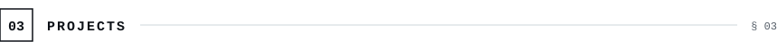
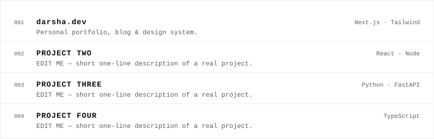
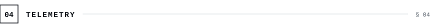

<!-- ========================= BANNER (theme-aware) ========================= -->

<a href="https://darsha.dev">
  <picture>
    <source media="(prefers-color-scheme: dark)" srcset="./assets/dark/banner.svg">
    <source media="(prefers-color-scheme: light)" srcset="./assets/banner.svg">
    
  </picture>
</a>

<!-- ========================= 01 · 02 · 03 SECTIONS ========================= -->

<picture><source media="(prefers-color-scheme: dark)" srcset="./assets/dark/s01.svg"/></picture>
<picture><source media="(prefers-color-scheme: dark)" srcset="./assets/dark/whoami.svg"/></picture>

<picture><source media="(prefers-color-scheme: dark)" srcset="./assets/dark/s02.svg"/></picture>
<picture><source media="(prefers-color-scheme: dark)" srcset="./assets/dark/stack.svg"/></picture>

<picture><source media="(prefers-color-scheme: dark)" srcset="./assets/dark/s03.svg"/></picture>
<picture><source media="(prefers-color-scheme: dark)" srcset="./assets/dark/projects.svg"/></picture>

<!-- ========================= 04 · TELEMETRY (real-time, theme-aware) ========================= -->

<picture><source media="(prefers-color-scheme: dark)" srcset="./assets/dark/s04.svg"/></picture>

<picture><source media="(prefers-color-scheme: dark)" srcset="https://github-readme-stats.vercel.app/api?username=Its-darshu&show_icons=true&hide_border=true&count_private=true&include_all_commits=true&bg_color=00000000&title_color=f0f6fc&text_color=8b949e&icon_color=f0f6fc&ring_color=f0f6fc"/></picture>
<picture><source media="(prefers-color-scheme: dark)" srcset="https://streak-stats.demolab.com?user=Its-darshu&hide_border=true&background=00000000&ring=f0f6fc&fire=f0f6fc&currStreakLabel=f0f6fc&sideLabels=8b949e&currStreakNum=f0f6fc&sideNums=f0f6fc&dates=8b949e&stroke=30363d"/></picture>

<picture><source media="(prefers-color-scheme: dark)" srcset="https://github-readme-activity-graph.vercel.app/graph?username=Its-darshu&bg_color=00000000&color=f0f6fc&line=f0f6fc&point=f0f6fc&area_color=30363d&area=true&hide_border=true&radius=0&custom_title=CONTRIBUTION%20TELEMETRY"/></picture>

<!-- ========================= 3D CONTRIBUTION GRAPH (last) ========================= -->

